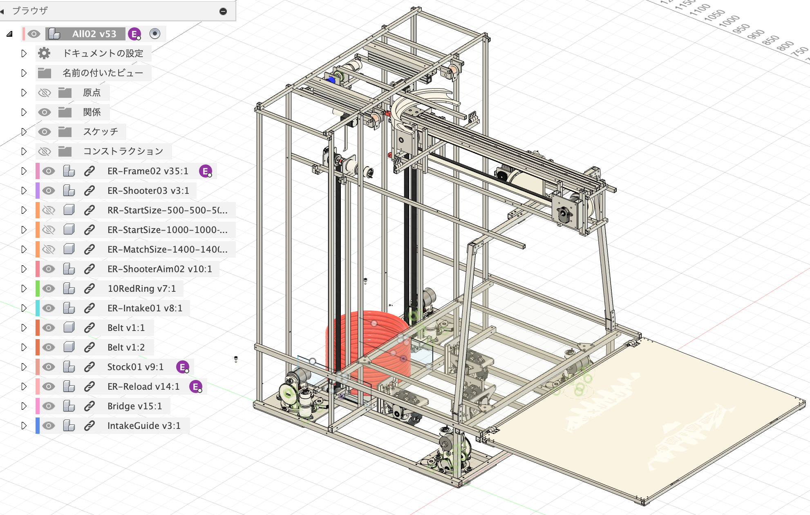
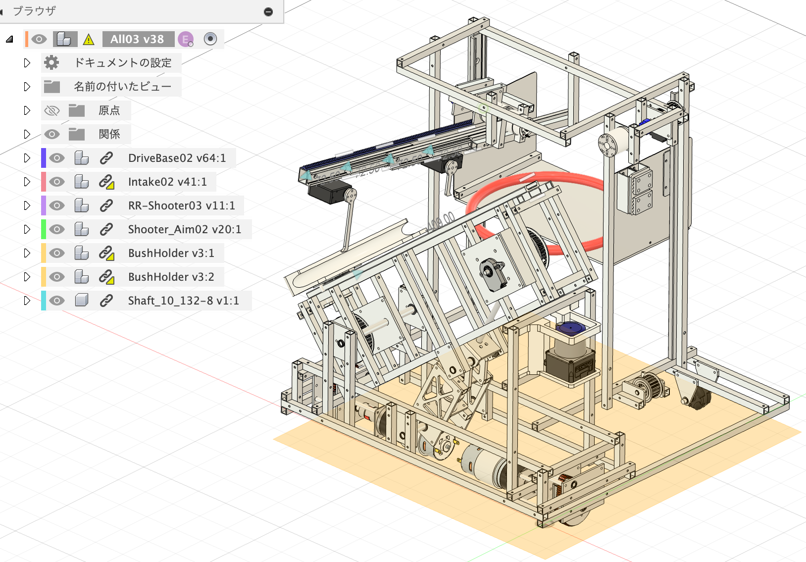
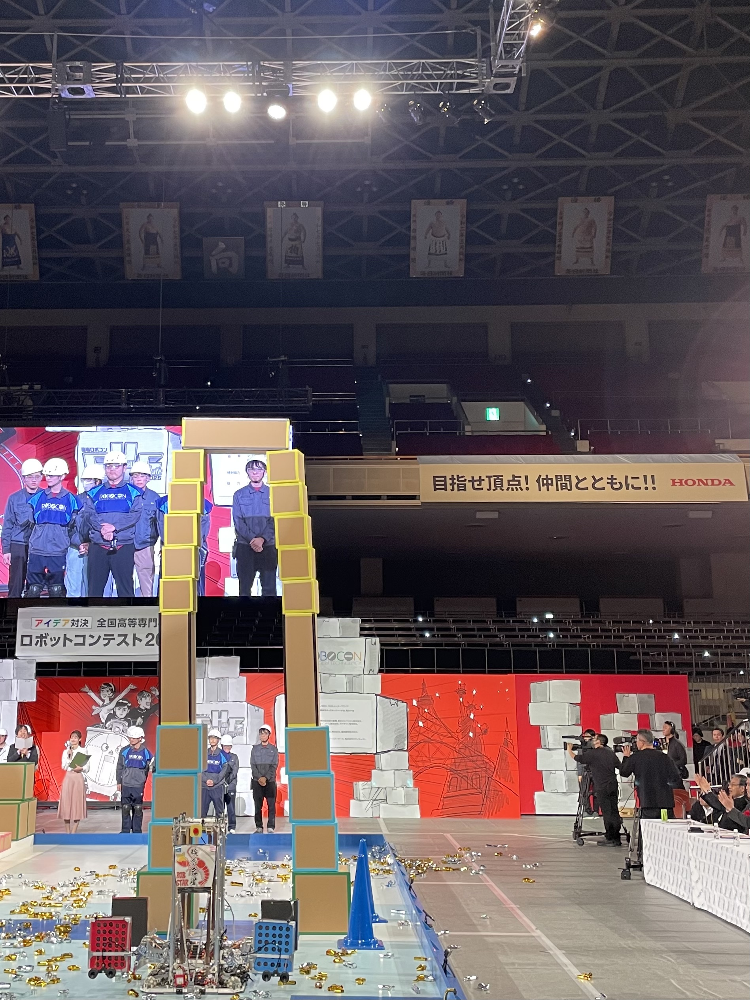
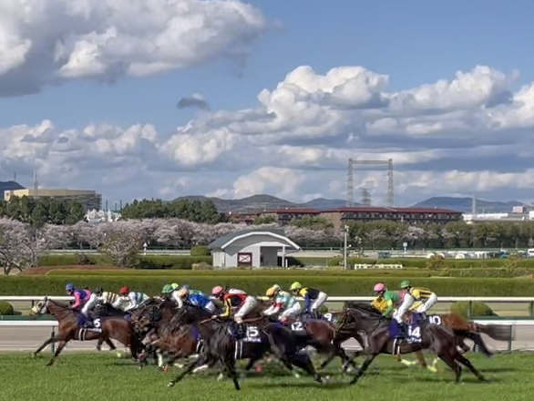

# About Me

とにかくロボコンが好きな社会人です。

この春から関西で社会人になりました。  
エスカレーターが右なの慣れない。

# Career

2018 東京工業大学附属科学技術高校 システムデザイン・ロボット分野 (現・東京科学大学附属科学技術高校 機械システム分野)

2021 電気通信大学 情報理工学域 II類計測・制御システムプログラム  
2025/04~ [金森研究室](http://www.rmc.mce.uec.ac.jp/) 所属  
2026/03 卒業  
2026 就職

# Robotics Competition Career

[ロボコン歴はこちら](./robocon-career.html)

<!-- # Skills -->

# Works

- NHK学生ロボコン2023のロボットの紹介
[画像はこちら](https://twitter.com/Lazuly_tech/status/1665911290844573697)

    - [激安Swerve Driveの紹介 〜ロマンチストと弱小校こそ独ステを作れ〜](https://lazuly.hatenablog.com/entry/uecsd2023)  
        学ロボ2023でぞうロボットに搭載したSwerve Driveの紹介記事です。  
        (就活でも実物を持っていきました。**第一印象としては**有効です。)
    - [絶対に真似してはいけないベル直の紹介](https://lazuly.hatenablog.com/entry/belt-throwing)  
        学ロボ2023で設計した射出機構の紹介記事です。

 

# Hobbies

ものづくり、ロボコン観戦、競馬観戦、格闘ゲームなど。

 

# Contact

|サービス|アカウント|備考|
|:---|:---|:---|
|X(Twitter)|[@Lazuly_tech](https://twitter.com/lazuly_tech)|ロボコン関連を中心に交流・発信しています |
|はてなブログ|[LINK](https://lazuly.hatenablog.com)|気まぐれで書きます|
|Facebook|[LINK](https://www.facebook.com/profile.php?id=100028977140855)|Instagramにつられてたまに動きます|

